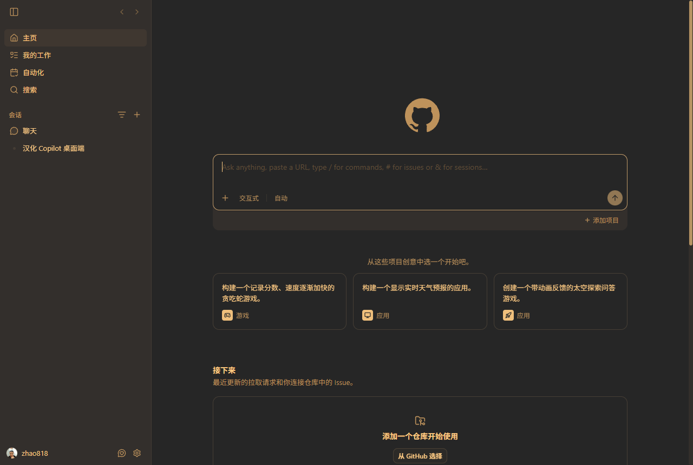

# GitHub Copilot 桌面端中文汉化 (copilot-desktop-zh)

> 非官方汉化补丁 · 运行时注入 · 不动应用本体 · 升级不失效



## 这是什么

给 **GitHub Copilot 桌面版** (Tauri + WebView2 架构) 提供中文界面的运行时汉化。

> ⚠️ **背景**:该应用没有内置中文,也没有语言文件/插件机制(二进制中无 zh-CN 字符串、
> 无 i18next、无 locales 加载逻辑,界面文案硬编码在 exe 里)。因此唯一的汉化方式是
> 通过 WebView2 调试端口做**运行时注入** —— 本项目即为此实现。

## 特性

- **不动应用本体**:不修改 github.exe,应用升级不受影响;
- **界面文案全覆盖**:侧边栏 / 主页 / 聊天 / 设置 / 自动化 / 命令面板 / 快捷键 / 弹窗 / 属性提示等(字典 980+ 条 + 动态模式);
- **实时生效**:页面内 MutationObserver + 3 秒轮询兜底,React 重渲染 / 刷新后自动重新应用;
- **不误翻内容**:AI 回复、代码块、技能名、会话标题、用户名等用户内容不会被翻译;
- **字典可扩展**:编辑 `dictionary.json` 保存即生效,无需重启。

## 环境要求

- Windows + GitHub Copilot 桌面版 (v1.1.x);
- **Node.js** (>= 18,用于运行注入器): https://nodejs.org

## 使用方法

1. 把整个文件夹放到任意位置(例如 `H:\copilot\GitHub Copilot\copilot-zh`);
2. 双击 **`启动 GitHub Copilot 中文版.cmd`** —— 会以调试模式启动 Copilot 并运行注入器;
3. 应用界面即为中文。命令行窗口保持打开(注入器在运行),关闭窗口 = 停止实时汉化。

> ⚠️ **注意**:必须用这个启动器打开应用才是中文;直接点官方图标启动的仍是英文。

## 工作原理

1. 启动器设置环境变量 `WEBVIEW2_ADDITIONAL_BROWSER_ARGUMENTS=--remote-debugging-port=9222` 后启动应用(WebView2 官方调试开关);
2. 注入器 (`inject.js`) 通过 CDP 连接页面 (`http://tauri.localhost`),把字典注入页面:
   - 精确匹配文本节点 → 替换为中文;
   - 同步翻译 placeholder / aria-label / title / alt;
   - 正则模式处理动态文案(如 `9% used` → `$1% 已使用`);
   - 整句机制处理被拆分的文本节点;
   - 跳过代码块 / 输入框 / 用户内容。

## 自定义翻译

编辑 `dictionary.json`:

| 区块 | 作用 | 示例 |
|---|---|---|
| `texts` | 精确文本替换 | `"Home": "主页"` |
| `textPatterns` | 文本正则替换 | `["^(\\d+)% used$", "$1% 已使用", ""]` |
| `attrs` | 属性精确替换 | `"Command palette": "命令面板"` |
| `attrPatterns` | 属性正则替换 | `["^Open user menu for (.+)$", "打开 $1 的用户菜单", ""]` |
| `wholeElements` | 整句(多文本节点)替换 | `"Chat: New chat": "聊天: 新建聊天"` |

保存后注入器会在 3 秒内自动重新读取并应用。

## 文件结构

```
copilot-zh/
├── 启动 GitHub Copilot 中文版.cmd   # 一键启动器(设置调试参数 → 启动应用 → 运行注入器)
├── inject.js                        # CDP 注入器(Node.js,每次轮询重读字典)
├── dictionary.json                  # 翻译字典(文本/属性/正则/整句)
├── cdp-eval.js                      # 调试工具(对页面执行任意 JS 表达式)
├── README.md
├── LICENSE                          # MIT
└── 最终效果截图.png                  # 效果预览
```

## 已知限制

- 图标 / 图片内嵌的英文无法翻译;
- 未收录的动态拼接文案会保留英文(可自行补充字典);
- 调试端口 9222 仅供本机访问;如与其他调试器冲突,可自行改端口(需同步改启动器与 `inject.js`);
- 汉化是运行时注入,关闭注入器或刷新页面后恢复英文(重新打开启动器即恢复中文)。

## 免责声明

本项目是**非官方**社区汉化,与 GitHub 公司无关。仅供学习交流使用,请遵守 GitHub Copilot 服务条款。

## License

MIT